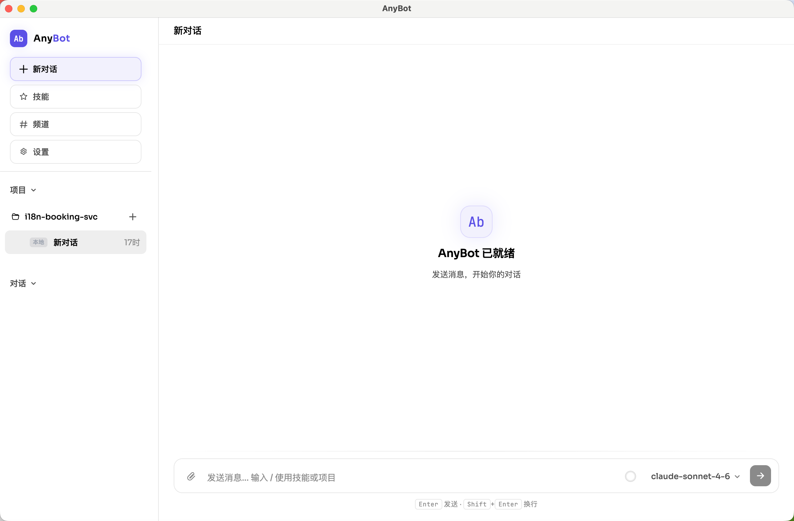
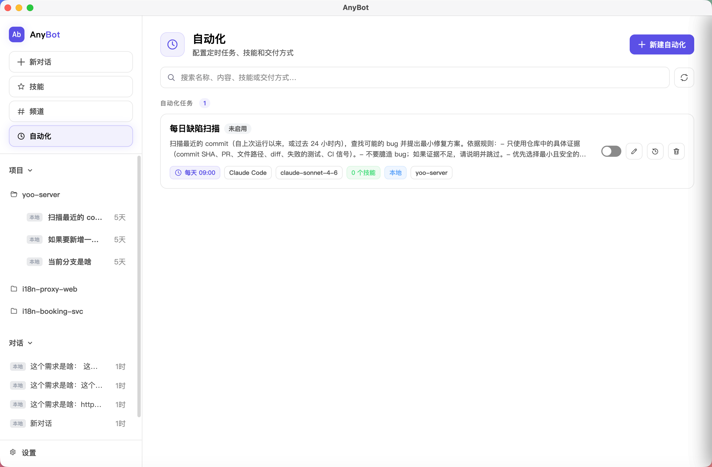
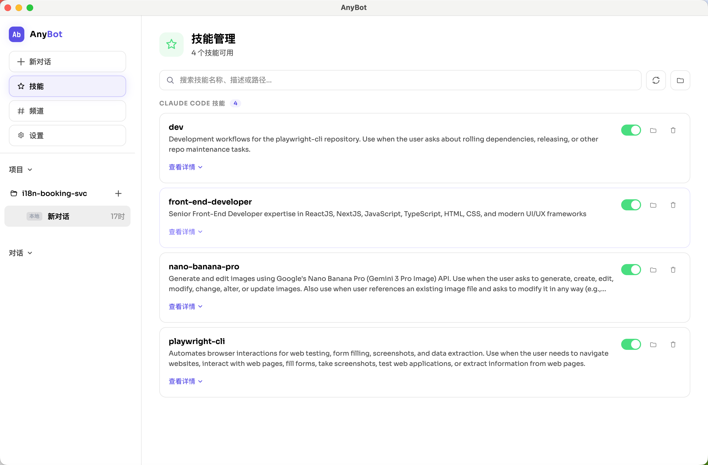
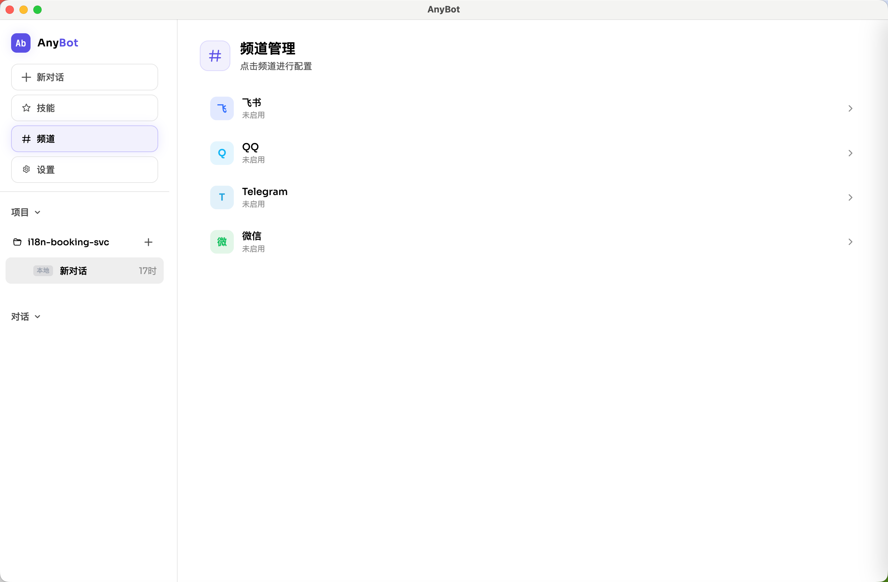
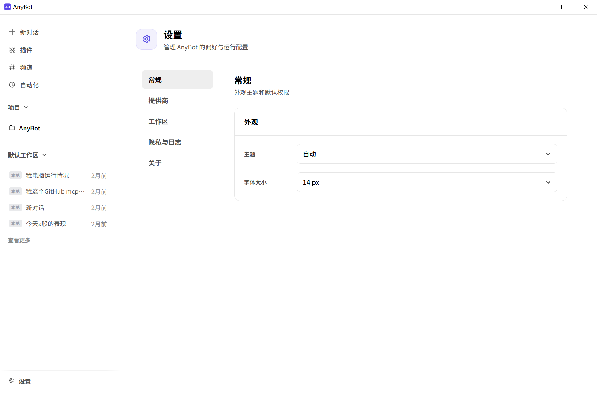

**中文** | [English](./README_EN.md)

# AnyBot

AnyBot 是一个运行在你自己电脑上的 AI Agent 工作台，把 Codex CLI、Claude Code 等本地 Agent 能力接入桌面 App、Web UI 和常用聊天渠道。你可以在内置 **Web UI** 中对话、管理项目、查看 Agent 执行过程、审核文件变更和配置自动化任务；也可以通过 **飞书机器人**、**QQ 机器人**、**Telegram 机器人** 或 **个人微信** 在手机和桌面端远程使用这台机器上的 Agent。

当前 Provider 支持 [OpenAI Codex CLI](https://developers.openai.com/codex/cli) 和 [Claude Code](https://code.claude.com/docs/en/overview)。桌面 App 支持 **macOS** 和 **Windows**；源码运行支持 **macOS**、**Linux** 和 **Windows**。

---

## 特性

- **多 Provider**：支持 Codex CLI 和 Claude Code，可在 Web UI 或频道命令中切换 Provider 和模型。
- **Agent Web UI**：本地聊天界面，支持 Markdown、代码高亮、流式 Agent 事件、停止响应、上下文压缩和会话历史。
- **项目工作区**：在侧边栏管理项目，项目会话会把项目目录作为 Provider 工作目录；也支持在单轮消息中额外选择项目。
- **技能入口**：Web UI 可浏览、启用、禁用、删除技能，并在输入框 `/` 菜单中按当前 Provider 展示可用技能和命令。
- **附件上传**：Web UI 支持按钮、粘贴图片和拖拽上传，单文件上限 50MB；图片能力取决于当前 Provider。
- **变更审核**：Agent 修改文件后生成变更快照，可在 Web UI 中查看 diff、通过或撤销。
- **多频道接入**：支持飞书长连接、QQ Bot WebSocket、Telegram 长轮询和个人微信通道。
- **主动推送**：通过 `/api/send` 向已配置 Owner 的频道发送通知。
- **自动化任务**：在本机按分钟、每天、每周或 Cron 触发 Agent 任务；过程在 Web UI 展示，结果可保存到本地或交付到已启用频道。
- **桌面体验**：Electron 桌面壳、托盘、开机启动、Windows 安装版应用内更新。

---

## 截图预览

| 新对话 | 自动化 |
|:---:|:---:|
|  |  |

| 技能 | 频道 |
|:---:|:---:|
|  |  |

| 设置 |
|:---:|
|  |

---

## 快速开始

### 1. 安装桌面 App（推荐）

从 [GitHub Releases](https://github.com/1935417243/AnyBot/releases) 下载对应平台安装包：

| 平台 | 安装包 | 说明 |
|------|--------|------|
| Windows | `AnyBot-Setup-x.x.x.exe` | 双击安装后从开始菜单或桌面快捷方式启动 |
| macOS | `AnyBot-x.x.x-*.dmg` | 打开 `.dmg`，将 `AnyBot.app` 拖到 Applications 后启动 |

桌面 App 不要求用户手动安装 Node.js。启动后会自动打开 AnyBot 窗口，Provider、模型、权限、项目、频道和隐私设置都可以在 Web UI 中配置。

Windows 安装版支持在 **设置 -> 关于 -> 检测更新** 中检查新版本；macOS 暂时需要手动下载新版 `.dmg` 覆盖安装。

#### macOS 提示“应用已损坏，无法打开”

如果你确认安装包来自 AnyBot 的 GitHub Releases，可以在终端执行：

```bash
sudo xattr -rd com.apple.quarantine "/Applications/AnyBot.app"
```

如果 Applications 中应用名显示为 `Anybot.app`，请把命令里的路径改成实际名称。

### 2. Provider 前置配置

至少配置一个 Provider：

| Provider | 安装方式 | 说明 |
|----------|---------|------|
| Codex CLI | 随 `@openai/codex-sdk` 依赖安装 native binary；仍需要完成本机 Codex 登录或配置，安装说明见 [Codex CLI 文档](https://developers.openai.com/codex/cli) | 支持会话续聊、Sandbox、图片输入 |
| Claude Code | 默认使用 `@anthropic-ai/claude-agent-sdk` 随包能力；需要外部 CLI 时可在高级设置中指定，安装说明见 [Claude Code 文档](https://code.claude.com/docs/en/overview) | 支持会话续聊、Sandbox 映射、Agent 流式事件 |

### 3. 源码运行

源码运行和开发建议使用 **Node.js 22**，以贴近 CI 环境。

```bash
git clone https://github.com/1935417243/AnyBot.git
cd AnyBot
npm ci
npm start
```

启动后打开 `http://localhost:19981` 使用 Web UI。

### 4. 后台运行

```bash
npm run bot:start
npm run bot:status
npm run bot:stop
```

---

## Provider 架构

| Provider | 状态 | 图片输入 | 说明 |
|----------|------|----------|------|
| `codex` | 可用 | 支持 | 使用 Codex SDK/CLI，支持 Sandbox 模式和 Agent 事件 |
| `claude-code` | 可用 | 暂不支持 | 使用 Claude Agent SDK，支持会话续聊、权限模式和上下文压缩 |

Provider 和模型选择会在 Web UI 中保存；每个 Provider 会记住上次选择的模型。

---

## Web UI

Web UI 是当前推荐入口，主要能力包括：

- 多会话历史和 SQLite 持久化。
- 项目管理、项目会话、目录树和默认工作目录设置。
- Markdown 渲染、代码复制、长消息折叠、上下文用量展示。
- Agent 流式过程展示、取消响应、`/compact` 上下文压缩。
- 文件上传、图片预览、本地图片访问。
- Slash picker：按当前 Provider 展示技能、项目和 Provider 原生命令。
- 变更审核：展示 Agent 改动 diff，支持通过或撤销。
- Provider、模型、Sandbox/权限、应用外观、日志、数据导入导出和频道配置。
- 技能管理：按 Provider 隔离扫描技能目录，支持启用、禁用、删除和打开文件夹。
- 自动化任务管理：配置触发时间、Provider、模型、项目、技能和交付方式；本地调度器会按配置新建会话并执行任务。

---

## 频道能力

不同频道受平台协议限制，支持范围不同：

| 频道 | 接入方式 | 输入 | 输出 | 备注 |
|------|----------|------|------|------|
| 飞书 | 长连接事件订阅 | 文本、图片 | 文本、图片、`FILE:` 文件 | 群聊默认仅 @ 回复，可配置为全部回复 |
| QQ Bot | WebSocket 网关 | 文本 | 文本 | 支持频道、群聊和 C2C/私聊事件 |
| Telegram | Bot API 长轮询 | 文本、图片 | 文本 | 图片 caption 会作为上下文；长回复自动拆分 |
| 个人微信 | 微信通道协议 | 文本、图片、文件 | 文本、图片、`FILE:` 文件 | 扫码绑定，不需要 OpenClaw |

所有频道都支持频道命令：`/help`、`/new`、`/provider`、`/model`、`/workspace`。不带 `/` 的 `provider 1`、`model 1`、`workspace 1` 也可用于按序号切换。

### 频道配置

频道配置保存在 `.data/channels.json`，推荐直接在 Web UI 中管理。

```jsonc
{
  "feishu": {
    "enabled": false,
    "appId": "",
    "appSecret": "",
    "groupChatMode": "mention",
    "botOpenId": "",
    "ackReaction": "OK",
    "ownerChatId": ""
  },
  "qqbot": {
    "enabled": false,
    "appId": "",
    "appSecret": "",
    "ownerChatId": ""
  },
  "telegram": {
    "enabled": false,
    "token": "",
    "ownerChatId": ""
  },
  "weixin": {
    "enabled": false,
    "accountId": "",
    "token": "",
    "baseUrl": "https://ilinkai.weixin.qq.com",
    "botType": "3",
    "botAgent": "AnyBot/0.1.0",
    "ownerChatId": ""
  }
}
```

### 飞书

在飞书开放平台创建应用后，开启机器人能力和长连接模式，订阅 `im.message.receive_v1`，授予发送消息权限；如需处理图片，还需要读取消息资源相关权限。

### QQ Bot

在 QQ 开放平台创建机器人应用，获取 App ID 和 App Secret，并配置消息接收权限。当前实现接入公域/频道消息、群聊和 C2C/私聊事件。

### Telegram

通过 [@BotFather](https://t.me/BotFather) 创建机器人并获取 Bot Token。群组中需要 @ 机器人或使用带 bot 名称的命令触发回复。

### 个人微信

启用微信频道后，首次启动会生成二维码，用个人微信扫码确认。扫码成功后会写回 `accountId`、`token` 和 `ownerChatId`。如果登录态失效，清空 `weixin.token` 后重启即可重新绑定。

---

## 技能与 Slash

技能目录按 Provider 隔离：

| Provider | 技能目录 |
|----------|---------|
| `codex` | `$CODEX_HOME/skills/`，未设置时为 `~/.codex/skills/` |
| `claude-code` | `$CLAUDE_CONFIG_DIR/skills/`，未设置时为 `~/.claude/skills/` |

Web UI 的 `/` 入口会按当前 Provider 展示可用技能、项目和命令。技能只注入本轮选择的技能名，不注入技能描述或文件内容；项目选择会按项目名和绝对路径写入本轮提示词。

---

## 主动推送

AnyBot 保留了轻量本地 API，方便脚本把通知推送到已配置 Owner 的频道。常见用法是发送部署结果、定时任务结果或本机自动化提醒。

```bash
curl -X POST http://localhost:19981/api/send \
  -H "Content-Type: application/json" \
  -d '{"channel": "telegram", "message": "部署完成"}'
```

`channel` 可选 `feishu`、`qqbot`、`telegram`、`weixin`，需要对应频道配置 `ownerChatId`。

---

## 自动化任务

自动化运行在用户本机，不依赖云端服务。应用启动后会加载已启用任务，按 `nextRunAt` 找到最近一次执行时间并使用本地定时器触发；如果应用关闭或电脑睡眠，错过的任务不会在重启后补跑，会直接计算下一次未来执行时间。

每次自动化执行都会创建一个新的本地会话，继续走 `ChatRunner`，因此 Provider、模型、项目目录、技能、Agent 过程展示、消息落库和变更审核都与普通 Web UI 对话保持一致。交付方式只决定结果出口：选择“本地”时结果保存在运行记录中；选择频道时，App 内仍展示完整过程，频道只收到最终结果。

---

## 运行数据

默认运行数据写入 `.data/`，日志写入 `.run/`。桌面 App 会使用 Electron 的用户数据目录，并在其中维护 `.data/`、`.run/` 和上传目录。

常见文件：

- `.data/chat.db`：会话、消息、项目和自动化存储。
- `.data/app-settings.json`：应用设置。
- `.data/model-config.json`：Provider 与模型选择。
- `.data/runtime-config.json`：Sandbox/权限默认值。
- `.data/channels.json`：频道配置。
- `.data/disabled-skills.json`：技能启用状态。
- `.data/change-reviews/`：变更审核快照。

---

## 工作原理

- `src/index.ts` 启动 Provider、Web 服务和已启用频道。
- `src/chat-runner.ts` 是 Web UI 和频道进入模型调用的统一编排层，负责 Provider session、项目工作目录、prompt、消息落库、流式事件和变更审核。
- `src/automation-scheduler.ts` 是本地自动化调度器，负责跳过重启后错过的任务、触发到期任务、记录运行历史并交付最终结果。
- Web 会话和频道会话都绑定 Provider 原生 session，后续消息通过续聊机制保持上下文。
- 项目会话会把项目目录作为 Provider 工作目录；普通对话使用默认工作目录。
- Web UI 上传文件保存到工作目录下的 `tmp/uploads/`。
- Agent 回复中的本机图片路径和 `FILE: /path/to/file.ext` 只会在支持附件回传的频道中上传发送。
- 日志为单行 JSON，按日期和时间分片写入 `.run/`，默认保留 3 天。

---

## 项目结构

```text
AnyBot/
├── src/
│   ├── index.ts                    # 进程入口：启动 Provider、Web 服务和频道
│   ├── chat-runner.ts              # 会话编排：Provider 调用、流式事件、变更审核和消息落库
│   ├── automation-scheduler.ts     # 本地自动化调度、运行记录和结果交付
│   ├── app-settings.ts             # 应用设置读写
│   ├── sandbox-config.ts           # Provider sandbox / 权限模式配置
│   ├── prompt.ts                   # 共享系统提示词构建
│   ├── shared.ts                   # 共享运行配置、ID 和路径辅助
│   ├── logger.ts                   # 结构化日志
│   ├── lark.ts                     # 飞书 API（消息、文件、图片）
│   ├── message.ts                  # 消息解析（输入输出）
│   ├── providers/                  # Provider 抽象层
│   ├── channels/                   # 微信、Telegram、飞书、QQ 等频道集成
│   ├── web/                        # Express API、SQLite 存储和 Web UI 静态资源
│   │   ├── routes/                 # 领域路由
│   │   ├── services/               # 复用业务逻辑和纯辅助函数
│   │   └── public/                 # 无构建流程的 HTML / CSS / ES modules
│   └── agent/md_files/             # Agent 提示词模板
├── electron/                       # Electron 桌面入口与打包后处理
├── scripts/                        # 构建、发布资源复制和 daemon 辅助脚本
├── installer/windows/              # Windows 安装器配置
├── build/icons/                    # 桌面应用图标
├── assets/                         # README 截图和展示素材
└── package.json
```

---

## 开发命令

```bash
npm ci
npm run dev
npm run check
npm run build
npm run build:release
npm run electron:dev
npm run electron:build
```

提交前至少运行 `npm run check`。涉及桌面壳、发布资源或安装包时，运行对应 build/electron 命令。

---

## 添加新 Provider

1. 在 `src/providers/` 下实现 `IProvider`。
2. 在 `src/providers/index.ts` 中注册 Provider 工厂。
3. 在 `src/app-settings.ts` 和 `src/providers/index.ts` 中接入 Provider 专属运行配置。
4. 如需 Web UI slash 命令，实现 `listSlashCommands()`，并确保后端能可靠处理。

可参考 `src/providers/codex.ts` 和 `src/providers/claude-code.ts`。

---

## License

MIT
