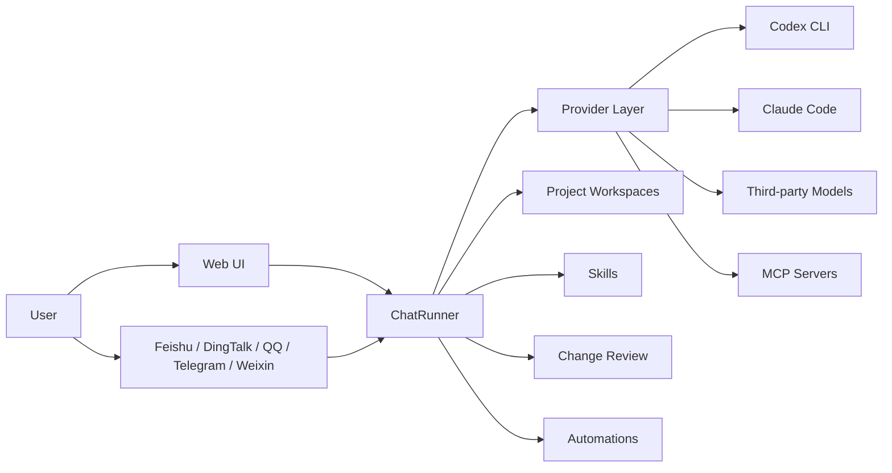

[中文](./README.md) | **English**

# AnyBot


AnyBot is a local AI Coding Agent console and remote entry point that lets you control and manage AI Coding Agents on your computer through the desktop app, Web UI, Weixin, QQ, Telegram, Feishu, DingTalk, and other channels.

AnyBot uses the platform native binaries provided by `@openai/codex-sdk` and `@anthropic-ai/claude-agent-sdk` by default, so users do not need to install `codex` or Claude Code globally. If needed, you can still configure an external CLI from settings. Provider settings, model mappings, environment variables, and MCP configuration are stored inside AnyBot.

If you do not want to use the machine's global model configuration, you can configure separate compatibility endpoints and model mappings inside AnyBot for Codex / Claude Code, connecting Aliyun Token Plan, DeepSeek, Kimi, MiniMax, Ollama (local), VibeAPI, or other Anthropic API-compatible services. AnyBot's settings only take effect inside AnyBot and do not affect the machine's global configuration.

The desktop app supports **macOS** and **Windows**; running from source supports **macOS**, **Linux**, and **Windows**.

---

## Features

- **Multiple Providers**: switch between Codex SDK/CLI and Claude Code from the Web UI or channel commands.
- **Compatible model access**: configure the Codex Responses compatibility layer and Claude Code Anthropic-compatible interface inside AnyBot, including Base URL, API Key, and model mappings.
- **MCP servers**: add, enable, disable, check, and inspect MCP Server logs from the Plugins page; verified servers are passed to both Codex and Claude Code.
- **Agent Web UI**: local chat UI with Markdown, code highlighting, streamed Agent events, cancellation, context compaction, and persistent history.
- **Project workspaces**: manage projects in the sidebar, including cloning from Git repositories, viewing and switching branches, and clearing the workspace; project sessions use the project path as the Provider working directory.
- **Skills and Plugins page**: the sidebar Plugins page manages skills and MCP servers together; skills are isolated per Provider and can be browsed, enabled, disabled, and deleted, and the `/` picker shows Provider-specific skills and commands.
- **Attachments**: upload by button, pasted images, or drag and drop. The upload limit is 50MB per file. Image support depends on the current Provider.
- **Change review**: after Agent edits, inspect diffs and approve or revert changes from the Web UI.
- **Channel integrations**: Feishu long connection, DingTalk Stream, QQ Bot WebSocket, Telegram long polling, and personal Weixin.
- **Proactive messaging**: send notifications to configured channel owners through `/api/send`.
- **Automations**: run local Agent tasks on minute, daily, weekly, or Cron schedules; activity stays visible in the Web UI, and final results can be saved locally or delivered to enabled channels.
- **Desktop app**: Electron shell, tray support, login item support, in-app download and installation for Windows installer builds, and GitHub latest-release checks on other platforms.

---

## Screenshots


---

## Architecture



---

## Quick Start

### 1. Install the Desktop App

Download the package for your platform from [GitHub Releases](https://github.com/1935417243/AnyBot/releases):

| Platform | Package | Notes |
|----------|---------|-------|
| Windows | `AnyBot-Setup-x.x.x.exe` | Install and launch from Start Menu or desktop shortcut |
| macOS | `AnyBot-x.x.x-*.dmg` | Open the `.dmg`, drag `AnyBot.app` into Applications, then launch |

The desktop app does not require users to install Node.js manually. Providers, models, MCP, permissions, projects, channels, automations, and privacy settings can be configured in the Web UI.

Windows installer builds support checking, downloading, and restarting to install updates from **Settings -> About -> Check for updates**. On macOS, download the new `.dmg` manually and overwrite the existing app. Source builds and platforms without automatic updates can still check the latest GitHub release from the About page.

#### macOS Says the App Is Damaged

If the package came from AnyBot's GitHub Releases, clear the quarantine attribute:

```bash
sudo xattr -rd com.apple.quarantine "/Applications/AnyBot.app"
```

If your app is named `Anybot.app`, adjust the path accordingly.

### 2. Configure a Provider

Configure at least one Provider:

| Provider | Runtime | Notes |
|----------|--------------|-------|
| Codex | Uses the platform native binary provided by `@openai/codex-sdk` by default, so a globally installed `codex` command is not required. When **Responses compatibility layer** is enabled, Codex only uses AnyBot's compatibility service configuration and model mapping | Session resume, sandbox, image input, MCP |
| Claude Code | Uses the platform native binary provided by `@anthropic-ai/claude-agent-sdk` by default, so a global Claude Code install is not required. Configure an external executable from advanced settings only when needed. See the [Claude Code docs](https://code.claude.com/docs/en/overview) | Session resume, sandbox mapping, streamed Agent events, MCP |

### 3. Run From Source

Use **Node.js 22** for local development to match CI.

```bash
git clone https://github.com/1935417243/AnyBot.git
cd AnyBot
npm ci
npm start
```

Then open `http://localhost:19981`.

### 4. Background Mode

```bash
npm run bot:start
npm run bot:status
npm run bot:stop
```

---

## Providers

| Provider | Status | Image input | Notes |
|----------|--------|-------------|-------|
| `codex` | Available | Supported | Codex SDK/CLI with sandbox, Agent events, context usage, and MCP |
| `claude-code` | Available | Not currently supported | Claude Agent SDK with session resume, permission modes, context compaction, streamed Agent events, and MCP |

Provider and model choices are saved from the Web UI. Each Provider remembers its last selected model.

## Compatible Model Support

AnyBot can configure Anthropic API-compatible services separately for Codex and Claude Code from settings. Built-in Base URL suggestions currently include Aliyun Token Plan, DeepSeek, Kimi, MiniMax, Ollama (local), and VibeAPI; you can also manually enter another compatible service URL.

Codex connects to compatible services through the **Responses compatibility layer**. When enabled, the Codex Provider uses AnyBot's local compatibility service configuration and model mapping with an isolated `CODEX_HOME`, so it does not affect the user's global `~/.codex` configuration.

Claude Code connects through the **Anthropic-compatible interface**. When enabled, the Claude Code Provider prefers AnyBot's configured Base URL, API Key, Auto/Opus/Sonnet/Haiku/Subagent model mappings, and optional external CLI path.

Common use cases:

- Use compatible models to drive the local Codex or Claude Code Agent.
- Select stable model aliases from the Web UI.
- Remotely call the local Agent from Feishu, DingTalk, QQ, Telegram, or personal Weixin.
- Combine project workspaces, skills, and automations for code analysis, scheduled checks, document generation, and similar local Agent tasks.

After enabling **Responses compatibility layer** under **Settings -> Providers -> Codex**, the chat box shows only the stable aliases `gpt-5.5`, `gpt-mini`, and `gpt-codex`. The actual upstream models are controlled by the mapping in settings. The Claude Code compatibility interface maintains mappings by purpose: Auto, Opus, Sonnet, Haiku / Fast, and Subagent.

---

## Web UI

The Web UI is the recommended entry point:

- Persistent multi-session history backed by SQLite.
- Project management, project sessions, directory tree browsing, Git repository cloning and branch switching, and default working directory settings.
- Markdown rendering, code copy, long-message folding, and context usage display.
- Streamed Agent activity, response cancellation, and `/compact` context compaction.
- File uploads, image preview, and local image access.
- Slash picker for Provider-specific skills, projects, and native Provider commands.
- Change review with diff inspection, approve, and revert.
- Provider, model, sandbox/permission, appearance, logs, data import/export, and channel settings.
- Plugins page: unified management of skills (Provider-isolated skill directory scanning with enable, disable, delete, and open-in-folder) and MCP servers.
- Automation task management: configure schedule, Provider, model, project, skills, and delivery method; the local scheduler creates a new session for each run.

---

## Channel Capabilities

Channel support varies by platform protocol:

| Channel | Transport | Input | Output | Notes |
|---------|-----------|-------|--------|-------|
| Feishu | Long connection events | Text, images | Text, images, `FILE:` files | Group chats reply on mention by default |
| DingTalk | Stream robot events | Text, images, files | Markdown, images, `FILE:` files | Direct chats auto-save Owner; attachments are limited to 20MB |
| QQ Bot | WebSocket gateway | Text, images, files | Markdown, images | Supports guild, group, C2C/direct events; non-image files are returned as local paths |
| Telegram | Bot API long polling | Text, images | Text | Captions are included as context; long replies are split |
| Personal Weixin | Weixin channel protocol | Text, images, files | Text, images, `FILE:` files | QR login, no OpenClaw required |

All channels support `/help`, `/new`, `/provider`, `/model`, and `/workspace`. The non-slash forms `provider 1`, `model 1`, and `workspace 1` also work for numbered selections.

### Channel Config

Channel config is stored in `.data/channels.json` and is best managed from the Web UI.

```jsonc
{
  "feishu": {
    "enabled": false,
    "appId": "",
    "appSecret": "",
    "groupChatMode": "mention",
    "botOpenId": "",
    "ackReaction": "OK",
    "ownerChatId": ""
  },
  "qqbot": {
    "enabled": false,
    "appId": "",
    "appSecret": "",
    "ownerChatId": ""
  },
  "dingtalk": {
    "enabled": false,
    "appId": "",
    "appSecret": "",
    "robotCode": "",
    "ownerChatId": ""
  },
  "telegram": {
    "enabled": false,
    "token": "",
    "ownerChatId": ""
  },
  "weixin": {
    "enabled": false,
    "accountId": "",
    "token": "",
    "baseUrl": "https://ilinkai.weixin.qq.com",
    "botType": "3",
    "botAgent": "",
    "ownerChatId": ""
  }
}
```

When `weixin.botAgent` is left empty, it defaults to the current app version (for example, `AnyBot/1.0.0`).

### Feishu

Create an app in the Feishu Open Platform, enable bot capability and long connection mode, subscribe to `im.message.receive_v1`, and grant message sending permissions. To handle images, also grant message resource read permissions.

### DingTalk

Create a Stream robot app in the DingTalk Open Platform, then fill in the App Key and App Secret. After the robot receives a message, AnyBot automatically caches `robotCode`; the first direct chat with the robot automatically records `ownerChatId` for proactive messaging and automation delivery.

### QQ Bot

Create a bot app in the QQ Open Platform, get the App ID and App Secret, and configure message receive permissions. The current implementation supports guild/channel messages, group messages, and C2C/direct events.

### Telegram

Create a bot through [@BotFather](https://t.me/BotFather) and get the Bot Token. In groups, mention the bot or use commands with the bot name to trigger replies.

### Personal Weixin

After enabling the Weixin channel, the first startup shows a QR code. Scan it with personal Weixin to bind. After binding, AnyBot writes back `accountId`, `token`, and `ownerChatId`. If the login state expires, clear `weixin.token` and restart to bind again.

---

## Skills and Slash

Skills are isolated by Provider:

| Provider | Skill directory |
|----------|-----------------|
| `codex` | Native Codex mode uses `$CODEX_HOME/skills/`, defaulting to `~/.codex/skills/`; with Responses compatibility layer enabled, it uses `codex/skills/` under AnyBot's runtime data directory |
| `claude-code` | `$CLAUDE_CONFIG_DIR/skills/`, defaulting to `~/.claude/skills/` |

The Web UI `/` picker shows skills, projects, and commands for the current Provider. Selected skills inject only skill names for the current turn. Selected projects inject project names and absolute paths for the current turn.

---

## MCP Servers

MCP Servers are managed in the **Plugins** page's "MCP Servers" tab, and their configuration is stored in `.data/app-settings.json`. AnyBot currently supports pasting an `mcpServers` JSON object or a single Server config containing `command` / `url`; supported types are `stdio`, `http`, and `sse`.

Enabled MCP Servers are checked on app startup. You can also refresh, recheck, view logs, disable, or delete them from the Plugins page. After verification, the same MCP configuration is passed to Codex and Claude Code: Codex receives Codex CLI `mcp_servers` config, while Claude Code receives Claude Agent SDK `mcpServers` config.

---

## Proactive Messaging

AnyBot keeps a lightweight local API so scripts can push notifications to configured channel owners. Common uses include deployment results, scheduled task output, or local automation alerts.

`/api` requires authentication: a random token is generated at startup and written to `.data/api-token` (override with `ANYBOT_API_TOKEN`). Local scripts can read it and pass it via the `Authorization: Bearer` header or the `?token=` query parameter.

```bash
TOKEN=$(cat .data/api-token)
curl -X POST http://localhost:19981/api/send \
  -H "Authorization: Bearer $TOKEN" \
  -H "Content-Type: application/json" \
  -d '{"channel": "telegram", "message": "Deploy finished"}'
```

`channel` can be `feishu`, `dingtalk`, `qqbot`, `telegram`, or `weixin`. The target channel needs `ownerChatId`.

---

## Automations

Automations run on the user's own machine and do not depend on a cloud service. After the app starts, it loads enabled tasks, finds the nearest `nextRunAt`, and uses a local timer to trigger due tasks. If the app is closed or the computer is asleep, missed runs are not replayed on restart; AnyBot calculates the next future run instead.

Each automation run creates a new local session and still goes through `ChatRunner`, so Provider selection, model choice, project working directory, skills, streamed Agent activity, message persistence, and change review behave like normal Web UI chats. Delivery only controls the final output: local delivery stores the result in run history, while channel delivery keeps the full process in the app and sends only the final result to the channel.

---

## Runtime Data

Runtime data defaults to `.data/`, and logs default to `.run/`. Desktop builds use Electron's user data directory and keep `.data/`, `.run/`, and uploads there.

Common files:

- `.data/chat.db`: sessions, messages, projects, and automations.
- `.data/app-settings.json`: app settings, Provider runtime configuration, and MCP Server configuration.
- `.data/model-config.json`: Provider and model selection.
- `.data/runtime-config.json`: sandbox defaults.
- `.data/channels.json`: channel config.
- `.data/api-token`: local API auth token (mode 0600), used by local scripts calling `/api`.
- `.data/proxy.json`: proxy configuration.
- `.data/disabled-skills.json`: skill enabled state.
- `.data/change-reviews/`: change review snapshots.
- `.data/codex/`: isolated `CODEX_HOME` used by the Codex Responses compatibility layer, including Codex sessions and skills.
- `.data/claude-code/`: isolated `CLAUDE_CONFIG_DIR` used by the Claude Code Anthropic-compatible interface.

---

## How It Works

- `src/index.ts` starts the Provider, Web service, enabled channels, desktop update checks, and MCP Server startup verification.
- `src/chat-runner.ts` is the shared orchestration layer for Web UI and channel messages. It handles Provider sessions, project working directories, prompts, message persistence, streamed events, and change review.
- `src/automation-scheduler.ts` is the local automation scheduler. It skips missed runs after restart, triggers due tasks, records run history, and delivers final results.
- Web sessions and channel sessions bind to native Provider sessions, and follow-up messages use session resume to keep context.
- Enabled MCP Servers are included in Provider call configuration for Codex and Claude Code tasks.
- Project sessions use the project directory as the Provider working directory; normal chats use the default working directory.
- Web UI uploads are saved under `tmp/uploads/` inside the working directory.
- Local image paths and `FILE: /path/to/file.ext` directives in Agent replies are uploaded only for channels that support attachment return.
- Logs are single-line JSON files split by date and time under `.run/`, with a default retention of 3 days.

---

## Project Structure

```text
AnyBot/
├── src/
│   ├── index.ts                    # Entry: Providers, Web service, channels, MCP checks, updates
│   ├── chat-runner.ts              # Session orchestration, Provider calls, events, persistence
│   ├── automation-scheduler.ts     # Local automation scheduling, run history, delivery
│   ├── app-settings.ts             # App settings
│   ├── sandbox-config.ts           # Provider sandbox / permission settings
│   ├── mcp-config.ts               # MCP config transformation (injected into Codex / Claude Code)
│   ├── prompt.ts                   # Shared system prompt builder
│   ├── shared.ts                   # Runtime config and path helpers
│   ├── logger.ts                   # Structured logging
│   ├── lark.ts                     # Feishu API helpers
│   ├── message.ts                  # Message parsing
│   ├── providers/                  # Provider implementations
│   ├── channels/                   # Weixin, Telegram, Feishu, DingTalk, QQ integrations
│   ├── web/                        # Express API, SQLite storage, Web UI static files
│   │   ├── routes/                 # Domain route modules
│   │   ├── services/               # Shared service logic
│   │   └── public/                 # Build-free HTML / CSS / ES modules
│   └── agent/md_files/             # Agent prompt templates
├── electron/                       # Electron desktop entry and packaging hooks
├── scripts/                        # Build, release assets, daemon helper
├── installer/windows/              # Windows installer config
├── build/icons/                    # Desktop icons
├── assets/                         # README screenshots and media
└── package.json
```

---

## Development

```bash
npm ci
npm run dev
npm run check
npm run build
npm run build:release
npm run electron:dev
npm run electron:build
```

Run `npm run check` before submitting changes. For desktop shell, release asset, or installer changes, also run the relevant build/electron command.

---

## Adding a Provider

1. Implement `IProvider` under `src/providers/`.
2. Register the Provider factory in `src/providers/index.ts`.
3. Add runtime config handling in `src/app-settings.ts` and `src/providers/index.ts`.
4. If the Provider exposes Web UI slash commands, implement `listSlashCommands()` and make sure the backend can handle them reliably.

Use `src/providers/codex.ts` and `src/providers/claude-code.ts` as references.

---

## License

MIT
